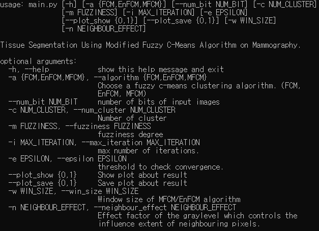
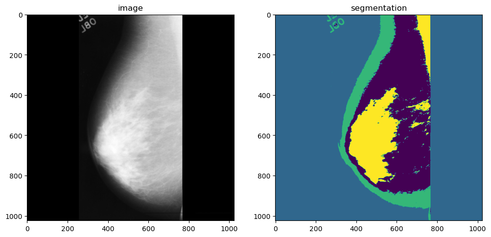
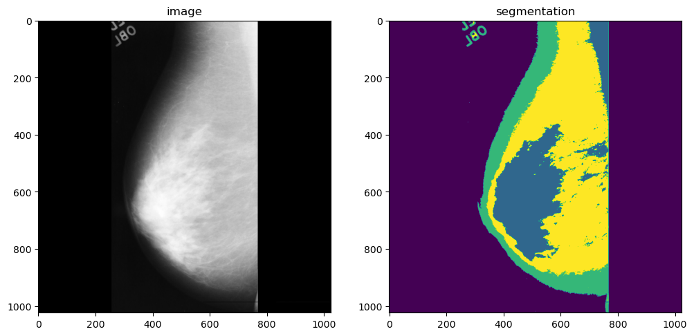
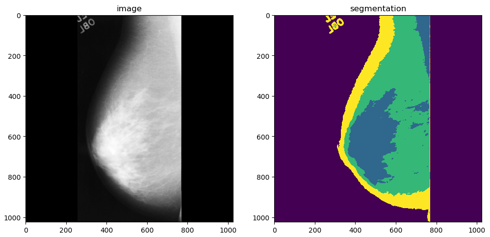

# FCM_segmentation (Python 3.7)
### Tissue Segmentation Using Various Fuzzy C-Means Algorithm on Mammography (Image segmentation)

This code uses various fuzzy c-means algorithms to do tissue segmentation on mammography. 
 * [Standard FCM](https://en.wikipedia.org/wiki/Fuzzy_clustering)
 * [Enhanced Fuzzy C-Means Algorithm (EnFCM)](https://ieeexplore.ieee.org/document/1279866)
 * [Modified FCM (MFCM)](https://ieeexplore.ieee.org/document/5687751)
  
## How to run?

### Run on mini data as default option 
You just run `main.py` in editor or enter `python main.py` in command prompt.
(In `img` directory, there are images for the test. These images are part of [_mini-MIAS database_](http://peipa.essex.ac.uk/info/mias.html).)

[<b>Default Option</b>]
- Algorithm: FCM
- Number of bits of input images: 8
- Number of clusters: 4
- Fuzziness degree: 2
- Max number of iterations: 100
- Threshold to check convergence: 0.05
- Plotting results
- Save results as image files (_\output\FCM_)


### User mode
- If you want to replace the mini data with your own data, put your images to `img` directory or edit path for your direrectory in `main.py`.   
- If you change parameters of your experiment, you can change parameters by changing the default value of the argument in `main.py` or you can you the command line in command prompt.
- You can see all the adjustable parameters and usage. ```python main.py --help```



  Example usage in the command prompt:
- Running the program with EnFCM algorithm: `python main.py --algorithm EnFCM` or `python main.py -a EnFCM'`
- Running the program with 5 clusters:  `python main.py --num_cluster 5` or `python main.py -c 5`
- Do not plot the results: `python main.py --plot_show 0`
## Results

<pre>
Iteration 0 : cost = 1572877.355810
Iteration 1 : cost = 16930.249564
Iteration 2 : cost = 62971.214897
Iteration 3 : cost = 220503.731791
Iteration 4 : cost = 668433.909952
Iteration 5 : cost = 507337.662709
Iteration 6 : cost = 175471.958149
Iteration 7 : cost = 114386.144020
Iteration 8 : cost = 73307.442600
Iteration 9 : cost = 44495.695964
Iteration 10 : cost = 25692.153765
Iteration 11 : cost = 17081.527860
Iteration 12 : cost = 12589.375744
Iteration 13 : cost = 9252.105186
Iteration 14 : cost = 6728.617855
Iteration 15 : cost = 4874.316781
Iteration 16 : cost = 3543.550238
Iteration 17 : cost = 2592.132178
Iteration 18 : cost = 1910.585002
Iteration 19 : cost = 1418.790884
Iteration 20 : cost = 1060.731109
Iteration 21 : cost = 797.630195
Iteration 22 : cost = 602.574438
Iteration 23 : cost = 456.886919
Iteration 24 : cost = 347.410607
Iteration 25 : cost = 264.742439
Iteration 26 : cost = 202.076947
Iteration 27 : cost = 154.435123
Iteration 28 : cost = 118.134485
Iteration 29 : cost = 90.428773
Iteration 30 : cost = 69.256245
Iteration 31 : cost = 53.061159
Iteration 32 : cost = 40.664660
Iteration 33 : cost = 31.170869
Iteration 34 : cost = 23.897207
Iteration 35 : cost = 18.322969
Iteration 36 : cost = 14.050185
Iteration 37 : cost = 10.774443
Iteration 38 : cost = 8.262844
Iteration 39 : cost = 6.336918
Iteration 40 : cost = 4.860020
Iteration 41 : cost = 3.727413
Iteration 42 : cost = 2.858808
Iteration 43 : cost = 2.192627
Iteration 44 : cost = 1.681706
Iteration 45 : cost = 1.289846
Iteration 46 : cost = 0.989259
Iteration 47 : cost = 0.758760
Iteration 48 : cost = 0.581969
Iteration 49 : cost = 0.446360
Iteration 50 : cost = 0.342367
Iteration 51 : cost = 0.262587
Iteration 52 : cost = 0.201409
Iteration 53 : cost = 0.154481
Iteration 54 : cost = 0.118486
Iteration 55 : cost = 0.090875
Iteration 56 : cost = 0.069699
Iteration 57 : cost = 0.053462
Iteration 58 : cost = 0.041010
</pre>

|Algorithm| Result |
|:---:|:---: |
|FCM||
|EnFCM| |
|MFCM| |    


## Troubleshooting:
1. If it is not an 8-bit image, the code may needs to be modified.
2. When there is a problem with the environment, you can try this command line in your command prompt. <pre> pip install -r requirements.txt </pre>

## References
* [1] [L. Szilagyi and et.al. "MR brain image segmentation using an enhanced fuzzy C-means algorithm." IEEE/ Engineering in Medicine and Biology Society (ICat.) 2003.](https://ieeexplore.ieee.org/document/1279866)
* [2] [Z. Chen and R. Zwiggelaar "A Modified Fuzzy C Means Algorithm for Breast Tissue Density Segmentation in Mammograms." IEEE/Information Technology and Applications in Biomedicine (ITAB) 2010.](https://ieeexplore.ieee.org/document/5687751)
* [3] [J. Song and Z. Zhang "A Modified Robust FCM Model with Spatial Constraints for Brain MR Image Segmentation." Information 2019.](https://www.researchgate.net/publication/331278874_A_Modified_Robust_FCM_Model_with_Spatial_Constraints_for_Brain_MR_Image_Segmentation)
* https://github.com/ab93/SIFCM

## TODO:
- [ ] Need to improve performance to get a filtered image in MFCM algorithm.